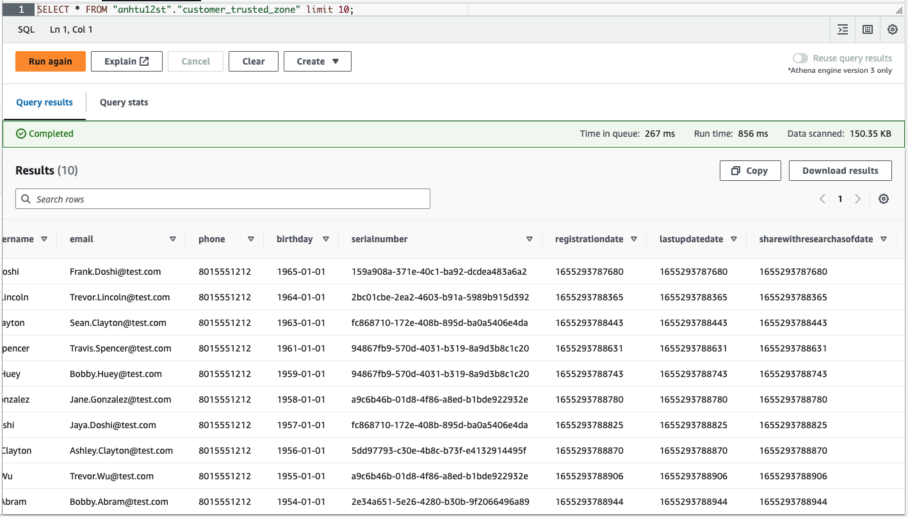

# Project: STEDI Human Balance Analytics

## Introduction

Spark and AWS Glue: processing data from multiple sources, categorizing data, and curating data to be queried in the future for purposes. Extract the data produced by Project Introduction: STEDI Human Balance Analytics. 

## Project Details

The STEDI Team has been hard at work developing a hardware STEDI Step Trainer that:

- trains the user to do a STEDI balance exercise;
- and has sensors on the device that collect data to train a machine-learning algorithm to detect steps;
- has a companion mobile app that collects customer data and interacts with the device sensors.

STEDI has heard from millions of early adopters who are willing to purchase the STEDI Step Trainers and use them.

Several customers have already received their Step Trainers, installed the mobile application, and begun using them together to test their balance. The Step Trainer is just a motion sensor that records the distance of the object detected. The app uses a mobile phone accelerometer to detect motion in the X, Y, and Z directions.

The STEDI team wants to use the motion sensor data to train a machine learning model to detect steps accurately in real-time. Privacy will be a primary consideration in deciding what data can be used.

## Implementation

### Landing Zone

**Glue Tables**:

- [customer_landing.sql](scripts/customer_landing.sql)
- [accelerometer_landing.sql](scripts/accelerometer_landing.sql)

**Athena**:
Landing Zone data query results

*Customer Landing*:

<figure>
  
</figure>

*Accelerometer Landing*:

<figure>
  
</figure>

### Trusted Zone

**Glue job scripts**:

- [customer_landing_to_trusted.py](scripts/customer_landing_to_trusted.py)
- [accelerometer_landing_to_trusted_zone.py](scripts/accelerometer_landing_to_trusted_zone.py)

**Athena**:
Trusted Zone Query results:

<figure>
  
</figure>

### Curated Zone

**Glue job scripts**:

- [customer_trusted_to_curated.py](scripts/customer_trusted_to_curated.py_)
